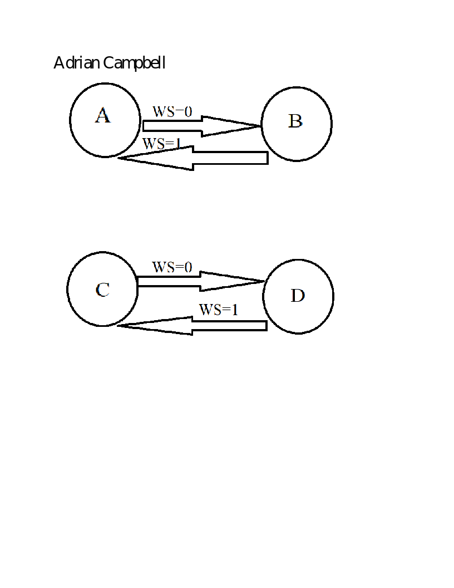

# CSE 241 Midpoint Assignment by Adrian Campbell
## Problem Explanation
  What we are designing in this problem are the current traffic light signals for two roads: a country road and a highway based on the state of three sensors. 
The three sensors are a counting sensor which determines how many vehicles have passed through an intersection, an overall sensor enabler which is in correspondence to the counting sensor, and last but not least a weather sensor which determines if it is currently snowing or not. One given fact is if the weather sensor is on then the 
counting sensor is off otherwise the counting sensor will always be on. Also, another given fact is if the sensor enabler is off then the traffic signal of the country road will be red. To add on, another given fact is if the counting sensor is off then the traffic signal for the country road will be red as well. In addition, another fact is the two traffic signals can either have one green and one red or two reds, but can never have two greens. From the facts given, a state diagram will be incorporated with the three sensors representing the inputs, and the weather sensor being the determining factor of what the next state will be as the sensor enabler being on or off is relied upon the current state of the weather signal. 
## State Diagram: 
A = 00

B = 01

C = 10

D = 11

WS stands for Weather Signal and 1 stands for it being on and 0 stands for it being off. For A-D above the first number stands for the sensor enabler and the second number stands for the counting sensor.

## Reasoning for the State Diagram
  In this state diagram we represented the current values of two inputs based on the value of the third input or the weather signal because the counting sensor being on or off is dependent on whether or not the weather signal is on or off so the inputs counting sensor and sensor enabler put together will change. Instead of putting the actual two input values it would be easier to just assign different input values a variable name instead of using the same on off or off on or on on values that way it would be easier to see the transitions from one state to another. 
## Considerations for the State Diagram
  Before the state diagram was formulated a lot of careful planning was going into it. First, a bulleted list describing the guidelines for each of the sensors was made and what the input and outputs meant. Next, a chart with three columns and four rows was made for the two inputs: the sensor enabler and the counting sensor. In the first column was the list of input values originally and the second column is the input values when the weather sensor is off. In addition, the last column is the list of input values when the weather sensor is on. A lot of trial and error happened before the final design of the state diagram. Down below will be the scrap paper with all the ideas and thought processes going into making the state diagram.

This project was designed and implemented by Adrian Campbell in
Spring 2022 for CSE241 at the University at Buffalo. Content in this
repository is not to be reproduced or utilized without written
authorization from the instructor, Dr. Winikus (jwinikus@buffalo.edu). 

